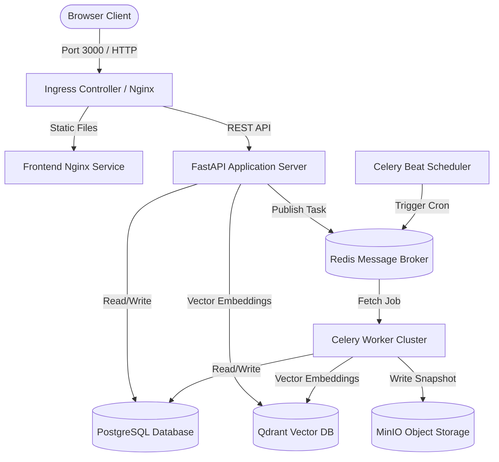

# Architecture & System Design Document

This document describes the technical architecture, design decisions, data flow pipelines, and scaling capabilities of the **AI Agent Behavior Simulator (AABS)**.

## 1. System Topology & Data Flow

AABS is structured as a decoupled multi-container application. The diagram below illustrates how client interactions propagate through the services:

---

## 2. Technology Choices & Rationale

* **Next.js & Tailwind CSS (Frontend)**: Next.js provides a robust, component-driven framework. By compiling pages to a static export (`output: 'export'`) served directly by Nginx, we minimize memory footprints, bypass node runtime overheads in production, and gain native support for Gzip/Brotli compressions.
* **FastAPI (Backend)**: Built on ASGI, FastAPI offers high-performance execution speeds comparable to Go or Node.js, automatic OpenAPI documentation, and native typing compatibility with Pydantic.
* **Celery & Redis (Task Execution)**: Running simulation ticks and calculating complex agent relationships at scale is resource-intensive. Offloading these runs from the HTTP request-response thread to asynchronous Celery worker pools ensures that UI interfaces remain highly responsive.
* **PostgreSQL (Storage)**: Relational schema handles state history tracking, structured tables, and metrics persistence.
* **Qdrant (Long-Term Memory)**: A purpose-built vector search engine is required to perform high-dimensional searches for agent memories, utilizing Cosine and Dot-product distance scoring.
* **MinIO (Artifact Snapshots)**: S3-compatible object storage allows self-hosted storage of massive simulation dumps, model checkpoints, and database daily pg_dumps.

---

## 3. Scaling Approach & Bottlenecks

### A. Horizontal Scaling
1. **API Nodes**: FastAPI backend servers are stateless and scale horizontally via Kubernetes HPAs based on CPU usage.
2. **Worker Cluster**: Celery workers are scaled dynamically based on task backlog queue depth.

### B. Memory and State Management
* **Database Scaling**: Large simulations write thousands of state records per minute. To resolve database write bottlenecks, the engine batches snapshots and records them asynchronously via workers, utilizing Postgres connection pooling (`pool_pre_ping=True`).
* **Vector Indexing**: Qdrant uses HNSW indexing. For extreme swarms, we allocate dedicated stateful resources and enable Qdrant memory mapping (mmap) to keep memory overhead manageable.
